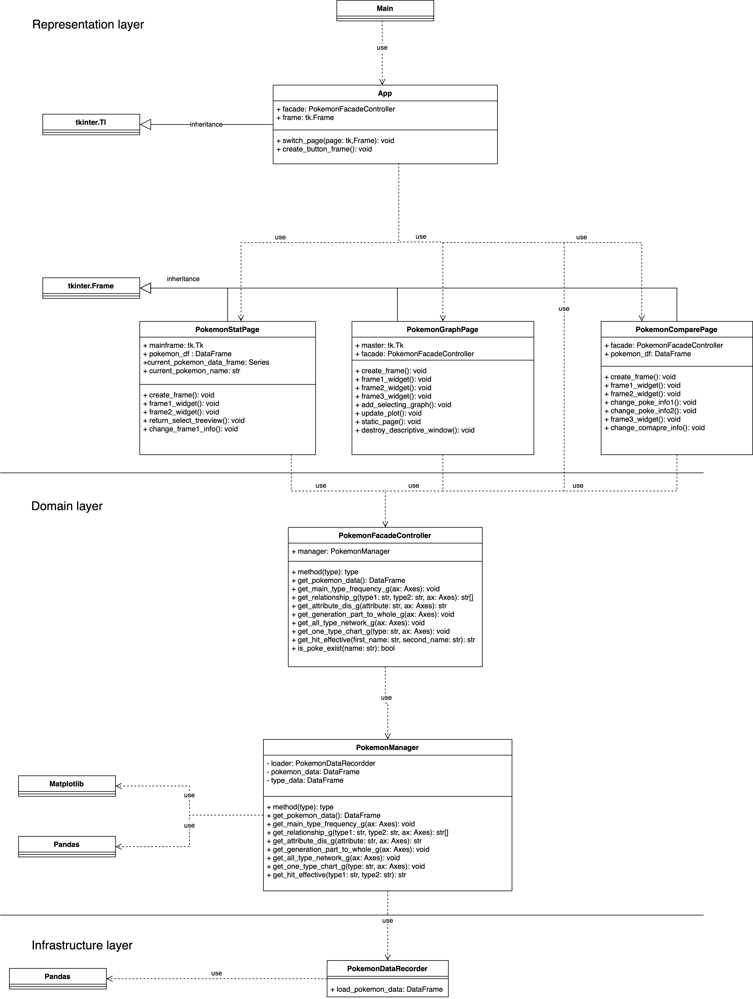

# Pokémon Scuffed Buddy
 
## Description
Pokémon Scuffed Buddy is a program that can help you can find a stat of each pokemon, visualize data up to gen 5, and comapre two pokemon main type attack effectiveness.

## Data Sources
Pokemon.csv contains all stat of pokemons up to generation 5.

* #: ID for each pokemon
* Name: Name of each pokemon
* Type 1: Each pokemon has a type, this determines weakness/resistance to attacks
* Type 2: Some pokemon are dual type and have 2
* Total: sum of all stats that come after this, a general guide to how strong a pokemon is
* HP: hit points, or health, defines how much damage a pokemon can withstand before fainting
* Attack: the base modifier for normal attacks (eg. Scratch, Punch)
* Defense: the base damage resistance against normal attacks
* SP Atk: special attack, the base modifier for special attacks (e.g. fire blast, bubble beam)
* SP Def: the base damage resistance against special attacks
* Speed: determines which pokemon attacks first each round

chart.csv contains hit effectiveness against each type.

Sources
* https://www.kaggle.com/datasets/abcsds/pokemon
* pokemon.com
* pokemondb
* bulbapedia

 
## Running the Application
Dependencies
* tkinter
* matplotlib
* pandas
* networkx
* seaborn
* matplotlib
* numpy
* PIL
 
## Design
Describe the overall design, including a UML class diagram and a sequence
diagram of a selected scenario.
### Class Diagram

+ PokemonDataRecoder is used for reading data.
+ PokemonManageer is the main class for the domain layer. it's doing all the logic.
+ PokemonFacadeController is used for the representation layer to call all fuction from domain layer.
+ App is the main windows of the program it can switch to all three pages which are
    - PokemonStatPage is used to view selected pokemon's stat.
    - PokemonGraphPage is used to view data virtualization of the data.
    - PokemonCaparePage is used to compare two pokemons' type using Dijkstra's algorithm.
    
### The following sequence diagram is for when the user choose pokemon to view it's stat

 
## Design Patterns Used
The facade disign patterns is used for this program, so the representative layer doesn't have to mess with the domain, and infrastructure layer.
 
## Graph Algorithm Used
User will select two pokemon, one pokemon is attacking, and the other defending. Every pokemon has an attack move with a different type, but in my program I assume that there are only the attack moves of the main type. Attack effectiveness can be normal,  super very effective, super effective, and doesn’t affect. Up to the attacking and defending type. We assume effectiveness is a weight of the attack between two types. The user can select two pokemons and compare them, by the weight between two types.

* There is a vertex for each pokemon type. Assume there are n types.
* There is a directed edge U -> V with weight that is up to effectiveness. For each type there is an edge to every other type.
    - 0.5 for Super Effective
    - 1 for Normal
    - 2 for Not Very Effective
    - 3 for Doesn’t Affect

* Weight is the effectiveness between two types
* We need to find the shortest distance from vertex U to vertex V.
* We can solve this problem by using Dijkstra's Algorithm from vertex U to vertex V. and output dist[V].
* The algorithm runs in O(V+E) = O(n+(n-1)*n)  = O(n^2)
	- n type so three are n-1 edge for each type

 
## Other Information
This is what the program look like when the user comnparing two pokemon types or checking pokemon's stat
The user can see pokemon's sprite that is selected

